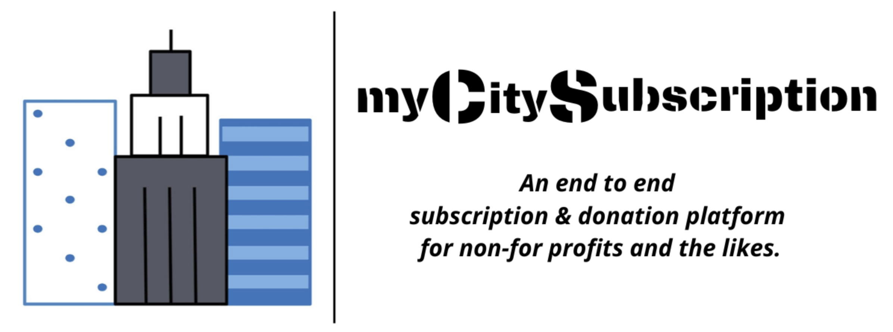
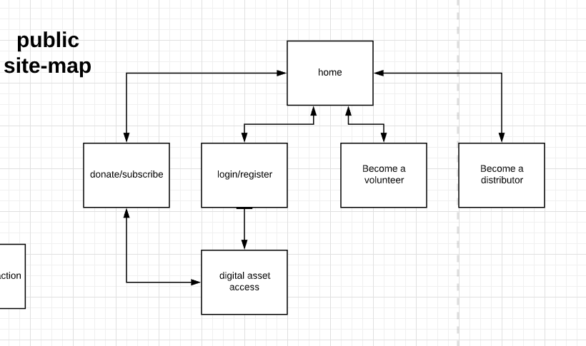
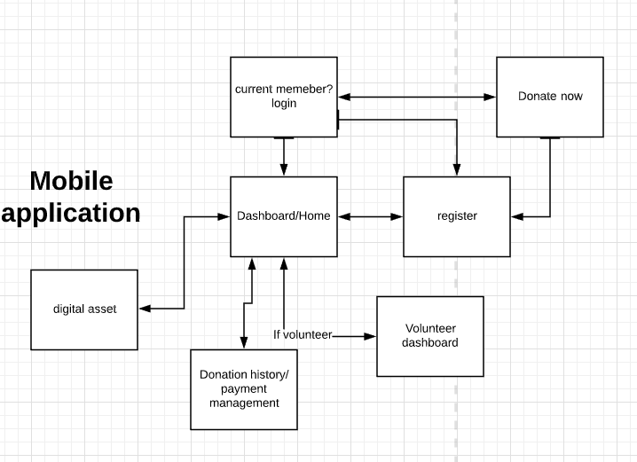
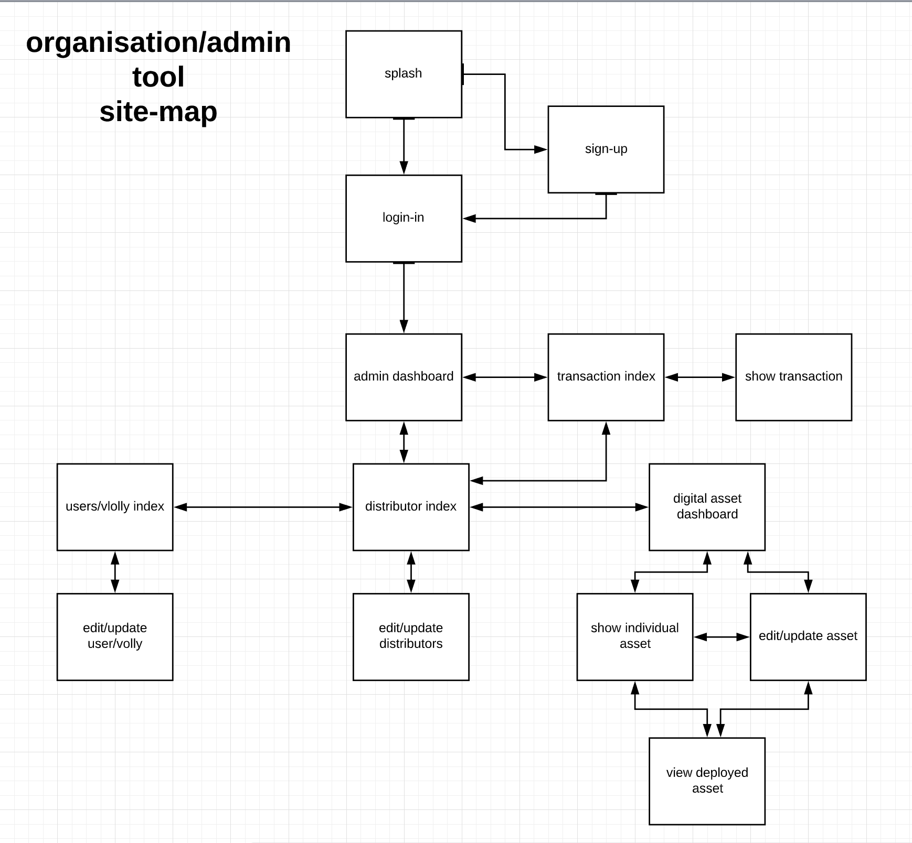

# myCitySubscription

A subscription based donation software for not-for-profits and the likes

---

## Contents
1. [The Problem](##The-Problem)
2. [The Solution](##The-Solution)
3. [The Application](##The-Application)
    * [Public Interface](###Public-Interface)
    * [Administrative Interface](###Administrative-Interface)
      - [Site Map](###MVP-Site-Map)
    * [Content Portal](###Content-Portal)
4. [Tech Stack](##Tech-Stack)
    - [Architecture](###Architecture)
    - [Data](###Data)

  ---

## The Problem

Modern society has become one hell of a beast to keep up with. The financial demands to keep a roof over our heads and a bed to sleep in at night are a privilege that only some of us are fortunate enough to have/afford.

When walking the streets of Brisbane City - where I live - I often see people sleeping rough. It's not an uncommon sight to see. We also have some pretty amazing not-for-profit  organizations doing what they can to provide support to people who don't share the luxury of roofs over their heads, or a warm bed to sleep in at night.

For example, Orange Sky is an organization that provides a laundry services for people doing it rough; and Beddown who provide temporary sleeping arrangements to give people a rest from a tougher environment.

We also have the Big Issue which is a fantastic service giving people who are sleeping rough an opportunity to distribute a magazine in return for some profit.

One thing that I have noticed in particular is that the current donation system could potentially be improved by the latest innovations in the tech world by people with the skills who are willing to help.

Often these donations require a card/cash transaction, or to stop and buy a physical product. However, many people do not carry around with them cash, and a single donation per person means a more volatile income. In other industries, a subscription-based model is becoming the norm to paying for services. It provides a stability of income, and is less hassle for people to provide ongoing support. I believe that the donation world could vastly benefit from this solution.

There are roughly 2.2 million people in Brisbane. If only half of those people donated 1 dollar per week we would be looking at approximately 2.5 million dollars per month that would go towards helping provide a better life for people in need.....and thats just in Brisbane.

Let's make this process as easy as possible.

## The Solution

myCitySubscription will be an open-source software platform that provides a digital solution that could potentially be used by not-for-profits, not unlike the Big Issue or other such services, That would allow for end-to-end management of a subscription/donation process.

Essentially it will allow people to sign up to a subscription at either a named price or a flexible price (decided by the providing organization). This would entitle the subscriber to receive a digital asset that the organization provides, on an ongoing basis of the purchaser's choice or potentially a one of purchase if they choose. The people on the street would simply have a unique code that they either distribute via some sort of cards or hold up on a sign which is unique to them. This ensures the profits go to this individual to help them carve a better life, whatever that means to them.

A subscriber/purchaser will log in to the site/app, enter the code and some basic details and the subscription will be active.

The administration of this software will be as automated as possible to decrease the need for labor costs to a not-for-profit.

## The Application

The platform will have:

- Organization / administrative platform with digital asset and volunteer management
- Public-facing website
- Mobile app with a volunteer management segment

### Public Interface

### MVP Public Website Sitemap

### MVP Mobile app map

### Administrative Interface

### MVP Site Map

<!--  -->

### Content Portal
---

## Tech stack

myCitySubscription will have a Ruby backend and a JavaScript frontend.

The backend API will be built out as a Sinatra application. This choice is due to the quick build times and ease of the high level Ruby language, coupled with the non-opinionated framework that sinatra provides. It will help avoid the unnecessary weight of a full opinionated Rails API. Thi allows us to structure the API and use middlewares as we choose to, as well as implement other application functionality as we choose.

There will be three front ends that interact with the sinatra API.

The main administration interface and the public facing responsive website will be built on React, a component based Javascript library. React provides a robust library of resources for building an interactive UI with the ability to only import what is needed for the job. React is extremely popular in the development community due to its ease of use and the ability to re-use components for a dry and lightweight codebase. Its ability to use state within components and the newly introduced event hooks to control the component life cycle ensure a quick and easy to develop interactive web app. Furthermore, the way that React segregates its endpoints in a fashion that maintains a "static" app makes it extremely easy to deploy and extremely quick to use and load.

The mobile app segment of the application will be built with React Native. React Native is a unique native application framework that essentially allows developers to create native applications written in JavaScript. React Native lets you create truly native apps and doesn't compromise on your users' experience. It provides a core set of platform agnostic native components like View, Text, and Image that map directly to the platform’s native UI building blocks.

Essentially there will be three font ends to this application that all interact in one way or another with the Sinatra API to perform CRUD actions and make relevant requests for data.

### Architecture

### Data

The application will use a gem called DataMapper to provide object-relational mapping to a MySql relational database. Mysql is an widely known, used, and highly scalable relational database which will help provide normalization of data out of the box. Data mapper as the name suggests enables us to interact with the database from our object orientated codebase with ease. It provides easy to use query syntax and easy data modelling options, and validation, as well as a 1 line connection to our database.

## More documentation coming soon!

## feedback and thoughts :

Twitter @RoarzOnRails

Linkedin https://www.linkedin.com/in/roarzonrails/
